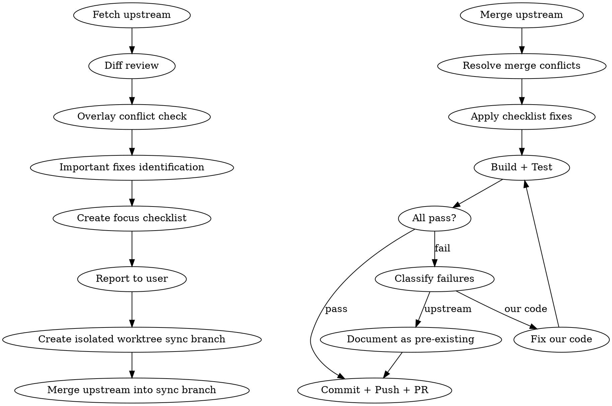

# Upstream Sync Review

## Overview

Sync upstream (new-api) updates into develop via a dedicated sync branch in an isolated worktree. Review catches overlay conflicts, highlights important fixes, applies necessary code changes, and verifies tests pass before PR. The PR targets `develop` and must not be merged by the agent.

## When to Use

- Weekly upstream sync (or on-demand when upstream has critical fixes)
- User says "合并upstream" / "sync upstream" / "拉取上游更新"

## Workflow



## Steps

### 1. Fetch & Assess Drift

```bash
git fetch upstream
git fetch origin
git rev-list --count origin/develop..upstream/main
git log origin/develop..upstream/main --oneline
```

### 2. Review Changes

```bash
git diff origin/develop...upstream/main --stat
git diff origin/develop...upstream/main -- <overlay-files>
```

Key review targets:
- Files listed in `OVERLAY.md` (our customizations)
- `relay/` changes (billing, adapter, stream)
- `model/` schema changes (migration compatibility)
- `middleware/` changes (auth, distributor)
- `dto/` struct changes (pointer semantics per Rule 6)

### 3. Build Focus Checklist

For each significant upstream change, note:
- What changed and why (from upstream commit messages)
- Whether it conflicts with an OVERLAY.md entry
- Whether it fixes something we also fixed (potential duplicate/divergence)
- Whether it touches billing pipeline or channel adapters (high-risk)
- Whether upstream introduced new fast-paths that bypass our overlay logic

### 4. Create Isolated Worktree Sync Branch & Merge

Default to a separate worktree so the user's current working directory, untracked files, and local branch state are not disturbed. Name the branch and worktree by date; if the branch or path already exists, add a short suffix such as `-2`.

```bash
git worktree add -b feature/upstream-sync-YYYY-MM-DD ../fy-api-upstream-sync-YYYY-MM-DD origin/develop
cd ../fy-api-upstream-sync-YYYY-MM-DD
git merge upstream/main
```

Important semantics:
- `git merge upstream/main` runs **inside the sync branch worktree**. It merges upstream's source branch into the sync branch; it does not merge anything into `main` or `develop`.
- Do not push or modify `main`.
- Do not merge the PR. Only create the PR targeting `develop`.

Resolve conflicts following OVERLAY.md as source of truth for our customizations.

### 5. Apply Checklist Fixes

After merge, apply all fixes identified in the checklist. Examples:
- Upstream adds a fast-path that skips our filter → add our field to the fast-path
- Upstream adds a new code path that bypasses our sanitizer → add sanitizer call
- Upstream changes a default we override → keep our override

**严禁跳过修复直接提 PR。所有 checklist 中的问题必须修完再提交。**

### 6. Build & Test

```bash
go build ./...
go test ./... -race
```

### 7. Classify Test Failures

Not all test failures block the PR. Classify each failure:

| Category | Action | Example |
|----------|--------|---------|
| **Our code, logic error** | Must fix before PR | Overlay function signature mismatch |
| **Our code, race condition** | Must fix before PR | `t.Parallel()` + global state init |
| **Upstream code, logic error** | Fix if trivial, else document | New test needs DB init we don't have |
| **Upstream code, race condition** | Document as pre-existing in PR | StreamScanner parallel test races |

How to distinguish:
1. Run failing test **individually** — if it passes alone but fails in batch → race condition
2. Run **without `-race`** — if it passes → race condition only
3. Check `git log --all -- <test-file>` — if from upstream commit → upstream issue
4. Check if test existed before this merge on develop → pre-existing

### 8. Commit + Push + PR

PR targets `develop`; the agent creates it and leaves it unmerged. Body must include:
- Upstream commit range (short hash..short hash)
- Key upstream fixes table (production-relevant)
- Overlay conflict resolution table (what was fixed and why)
- Pre-existing test issues section (clearly marked as NOT introduced by this merge)
- Test results section with specific commands and outcomes

```bash
git add -A
git commit -m "chore: merge upstream/main (N commits) with overlay conflict fixes"
git push -u origin feature/upstream-sync-YYYY-MM-DD
gh pr create --repo seraph0017/Fy-api --base develop --head feature/upstream-sync-YYYY-MM-DD --title "..." --body "..."
```

## Common Mistakes

| Mistake | Fix |
|---------|-----|
| Merging directly to develop without review | Always use a sync branch + PR |
| Working in the user's main checkout | Create an isolated worktree from `origin/develop` |
| Confusing `git merge upstream/main` with merging into main | Run it only inside the sync branch worktree; it uses upstream/main as the source |
| Merging the PR after creation | Stop after PR creation unless the user explicitly asks to merge |
| Losing overlay changes during conflict resolution | Check OVERLAY.md before accepting "theirs" |
| Missing billing/dto changes | Always review `--stat` for relay/, dto/, service/ |
| Forgetting to update OVERLAY.md | If upstream now includes our fix, remove from overlay |
| Skipping checklist fixes and going straight to PR | **严禁**。所有识别出的问题必须修完再提交 |
| Treating all -race failures as blockers | Classify: our code must fix, upstream pre-existing document |
| Not running tests individually to confirm race vs logic | Single test pass + batch fail = race condition |
| Fixing upstream test races in sync PR | Document only; fix upstream issues in separate PR if needed |

## Race Condition Handling Patterns

Common race sources in this codebase:
- `gin.SetMode()` in parallel tests → move to `TestMain`
- `service.InitHttpClient()` in parallel tests → move to `TestMain`
- Global state mutation with `t.Parallel()` → remove `t.Parallel()` or use `TestMain`
- Upstream tests with shared channel/goroutine state → document as pre-existing
