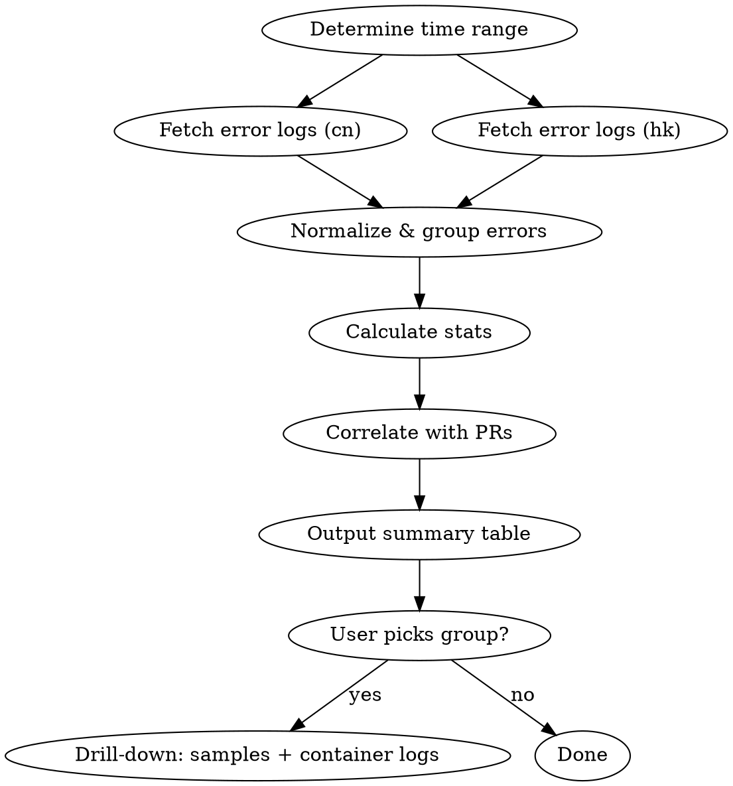

# Production Error Triage

Investigate and summarize production errors across cn and hk environments. Outputs a layered markdown report: summary table first, then drill-down on request.

## Environments

| Target | Base URL | Notes |
|--------|----------|-------|
| cn | `https://api.tracenex.cn` | Hangzhou production |
| hk | `https://api.aitracenex.com` | Hong Kong production |

## Data Sources

1. **Primary**: Admin API `GET /api/log/` with `type=5` (error logs)
2. **Secondary**: Container logs via SSH (`fab logs --target=cn/hk`)

## Execution Flow



## Step 1: Fetch Error Logs

For each environment (cn, sg), query the Admin API:

```bash
# Parameters:
#   type=5 (LogTypeError)
#   start_timestamp = now - N days (unix seconds)
#   end_timestamp = now (unix seconds)
#   page_size=100, iterate pages until all fetched

START_TS=$(date -v-3d +%s)  # 3 days ago (adjustable)
END_TS=$(date +%s)

# CN environment
curl -s "https://api.tracenex.cn/api/log/?type=5&start_timestamp=${START_TS}&end_timestamp=${END_TS}&p=0&page_size=100" \
  -H "Authorization: Bearer ${ADMIN_TOKEN_CN}"

# HK environment
curl -s "https://api.aitracenex.com/api/log/?type=5&start_timestamp=${START_TS}&end_timestamp=${END_TS}&p=0&page_size=100" \
  -H "Authorization: Bearer ${ADMIN_TOKEN_HK}"
```

Response shape: `{ "data": { "items": [...], "total": N, "page": P } }`

Each log item fields: `id`, `created_at` (unix ts), `content` (error message),
`model_name`, `channel` (channel_id), `channel_name`, `username`, `token_name`,
`request_id`, `upstream_request_id`, `use_time`, `is_stream`, `group`, `other` (JSON string).

**Pagination**: If `total > page_size`, fetch subsequent pages (`p=1, p=2, ...`).

**Fallback (API unavailable)**: SSH via fabric to grep container logs:
```bash
fab logs --target=cn --tail=2000 2>/dev/null | grep -i "error\|panic\|fatal"
fab logs --target=hk --tail=2000 2>/dev/null | grep -i "error\|panic\|fatal"
```

## Step 2: Normalize & Group Errors

Group errors by normalizing the `content` field:

1. Strip dynamic values: request IDs, timestamps, IP addresses, UUIDs
2. Replace specific model versions with wildcards (e.g., `gpt-4o-2024-08-06` → `gpt-4o-*`)
3. Truncate to first meaningful sentence (before stack trace details)

**Grouping key**: `{env}:{normalized_content}:{model_name}:{channel_id}`

For each group, track:
- `count`: total occurrences
- `first_seen`: earliest `created_at`
- `last_seen`: latest `created_at`
- `affected_users`: unique `username` count
- `sample_request_ids`: up to 3 request_ids for drill-down
- `sample_content`: one full unmodified error message

## Step 3: Calculate Stats

For each error group:

- **Error rate** = group count / total requests in same period
  - Total requests: query `GET /api/log/?type=2` (LogTypeConsume) with same time range, use `total` from response
  - Or approximate: `GET /api/log/stat` endpoint
- **Fix status**:
  - `last_seen` > 6 hours ago → "可能已修复" (likely fixed)
  - `last_seen` within 6 hours → "活跃" (active)
  - `last_seen` > 24 hours ago → "已修复" (fixed)
- **Trend**: compare first half vs second half of time window
  - Increasing → "恶化"
  - Decreasing → "好转"
  - Stable → "稳定"

## Step 4: Correlate with PRs

Search recent git history for commits that might fix each error:

```bash
# In the fy-api submodule
cd /Users/jimmy/go/src/tracenex/fy-api
git log --oneline --since="3 days ago" --all | grep -i "fix\|bug\|error\|修复"

# For specific error keywords, e.g. "timeout"
git log --oneline --since="7 days ago" --all --grep="timeout"
```

Also check merged PRs:
```bash
gh pr list --state merged --limit 20 --json number,title,mergedAt
```

Match PR titles/commits against error group keywords. Mark as "关联 PR" if found.

## Step 5: Output Report

### Layer 1: Summary Table (always output)

```markdown
## 🔍 生产环境错误摘要 ({time_range})

### CN 环境 (总请求: X, 总错误: Y, 整体错误率: Z%)

| # | 错误模式 | 模型/渠道 | 次数 | 错误率 | 最后出现 | 趋势 | 状态 | 关联 PR |
|---|---------|----------|------|--------|---------|------|------|---------|
| 1 | {pattern} | {model}/{ch} | N | X% | Nh前 | ↑/↓/→ | 🔴/🟡/🟢 | #N/- |

### HK 环境 (总请求: X, 总错误: Y, 整体错误率: Z%)

| # | 错误模式 | 模型/渠道 | 次数 | 错误率 | 最后出现 | 趋势 | 状态 | 关联 PR |
|---|---------|----------|------|--------|---------|------|------|---------|

### 总结
- 🔴 活跃问题: N 个
- 🟡 观察中: N 个
- 🟢 可能已修复: N 个
- 需要关注: {top priority items}
```

Status legend:
- 🔴 活跃: last_seen < 6h
- 🟡 观察中: 6h < last_seen < 24h
- 🟢 可能已修复: last_seen > 24h

### Layer 2: Drill-down (on request)

When user asks to drill into a specific error group:

1. Show 3 sample error messages (full `content`)
2. Show affected users and tokens
3. Fetch container logs around the error timestamps via SSH:
   ```bash
   fab logs --target={env} --tail=500 2>/dev/null | grep -B2 -A5 "{error_keyword}"
   ```
4. Show the `other` JSON field for additional context
5. Suggest potential root cause based on error pattern

## Auth Configuration

The skill needs admin API tokens. Check these locations:

1. Environment variables: `TRACENEX_ADMIN_TOKEN_CN`, `TRACENEX_ADMIN_TOKEN_HK`
2. If not set, prompt user to provide tokens
3. SSH access uses existing fabfile.py configuration (keys in ~/.ssh/)

## Common Error Patterns

| Pattern | Typical Cause | Quick Fix |
|---------|--------------|-----------|
| `upstream timeout` | Provider overloaded or network | Check channel health, consider disable |
| `invalid api key` | Key rotated/expired upstream | Update channel credentials |
| `rate limit exceeded` | Too many requests to provider | Adjust rate limits or add channels |
| `context length exceeded` | User sent too-long prompt | Frontend should warn; not a bug |
| `insufficient_quota` | Upstream billing issue | Top up provider account |
| `connection refused` | Provider endpoint down | Wait or switch channel |
| `bad gateway` | Nginx/proxy issue | Check container health |

## Tips

- Run daily, ideally in the morning, to catch overnight issues
- Focus on 🔴 active errors first
- Errors with high affected_users count are higher priority
- If error rate suddenly spikes, check if a recent deploy caused it
- Cross-reference cn vs hk: same error in both = upstream issue; only one = infra issue

