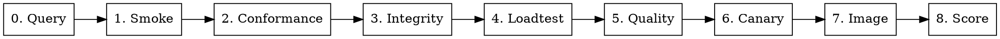

# Channel Benchmark — 全量渠道测试

## Overview

对指定渠道执行完整的 8 项测试，生成综合报告。标注 ⚠ 的测试项**不可跳过**。

## Prerequisites

运行前需要收集以下信息（如不清楚，交互询问用户）：

1. **测试环境 URL** — 例如 `https://api-test.tracenex.cn`
2. **渠道 ID** — 要测试的目标渠道编号
3. **User Token** — `sk-...` 格式，必须属于 admin 用户（pin_channel 需要）
4. **Admin Token** — 用于 Go 工具查询渠道信息（可选，无则跳过 Go smoke）
5. **Baseline 渠道 ID** — canary 完整检测用的可信对照渠道（提供相同模型）
   如果无对照渠道，可只跑 metadata + tokenizer 探针（stateless，无需 baseline）
6. **Embedding 模型** — 自动从网关发现，无需用户提供（Pre-flight B 步骤）
7. **Judge 模型** — 默认用被测模型自评；如用户提供外部 judge 则使用外部
8. **图片模型**（如有）— 用于 fy-image-loadtest / fy-image-conformance

如果 admin_token 未知，可通过 SSH 到测试服务器查询数据库获取。

## Pre-flight Checks

在执行任何测试前，完成以下验证：

### A. Python 依赖确认
```bash
cd scripts/channel-benchmark/py
source .venv/bin/activate
pip install tiktoken  # fy-integrity 注水探针必需，缺少会 SKIP
```

### B. Embedding 模型自动发现

查询网关上可用的 embedding 模型：
```bash
curl -s -H "Authorization: Bearer $TOKEN" "$BASE_URL/v1/models" | python -c "
import sys,json
data=json.load(sys.stdin)
models=[m['id'] for m in data.get('data',[]) if 'embed' in m['id'].lower()]
print('Available embedding models:', models if models else 'NONE')
"
```

**自动选择逻辑**（按优先级）：
1. `text-embedding-3-small`（OpenAI，性价比最高）
2. `text-embedding-ada-002`（OpenAI 旧版）
3. 任何包含 `embed` 的模型
4. 如果网关无 embedding 模型 → similarity 和 drift 探针自动跳过，在报告中标注

**无需用户手动提供 embedding 模型名**——自动从网关发现。如果网关没有 embedding 模型，相关探针降级跳过（不阻塞测试流程）。

## Test Suite



所有测试均在 `scripts/channel-benchmark/` 下执行。

### Step 0: 查询渠道信息

```bash
curl -s -H "Authorization: $ADMIN_TOKEN" -H "New-Api-User: 1" \
  "$BASE_URL/api/channel/$CHANNEL_ID"
```

确认渠道名称和支持的模型列表，用于后续配置。

### Step 1: Go Benchmark（基础连通 + 延迟）

工具：`scripts/channel-benchmark/go/`

创建配置文件，关键字段：
- `gateway.base_url` — 测试环境地址
- `gateway.admin_token` — admin access_token（不带 sk- 前缀）
- `gateway.user_token` — sk-... admin 用户 token
- `test.pin_channel: true` — 锁定渠道
- `channels[].id` — 目标渠道 ID
- `channels[].test_models` — 从 Step 0 获取的模型列表

```bash
cd scripts/channel-benchmark/go
go run . -config <config>.yaml
```

如果只有 sk- API key（无 admin access_token），跳过 Go smoke，
用 fy-loadtest 替代：`fy-loadtest -c <config>.yaml --concurrencies 1 --reps 5`

验证：所有请求成功率 100%，记录 E2E/TTFT P95。

### Step 2: fy-conformance（协议合规）⚠ 不可跳过

配置关键字段：
- `gateway.base_url / user_token / pin_channel_id` — 目标渠道
- `target.model` — 选一个渠道支持的模型
- `dataset: fy_conformance/datasets/public/conformance.jsonl`

```bash
cd scripts/channel-benchmark/py
fy-conformance -c <config>.yaml
```

验证：
- 关注 pass_rate，重点看 client_compat_* 和 openai_features 类别
- 如果 pass_rate < 80%，说明渠道有严重的协议兼容问题
- 关注是否泄漏 Go struct 字段名（如 `GeneralOpenAIRequest.max_tokens`）

### Step 3: fy-integrity（诚信审计 + 注水检测）⚠ 不可跳过

**token_inflation 探针必须成功执行，不能因为缺少 tiktoken 而 SKIP。**

配置关键字段：
- `gateway.base_url / user_token / pin_channel_id` — 目标渠道
- `target.model` — 逐一测试每个模型
- `probes.inflation.enabled: true`
- `probes.inflation.tolerance_tokens: 10`
- `probes.cache/determinism/tool_use/stream/filtering.enabled: true`
- `probes.isolation.enabled: false`（需要 secondary_token，没有则关闭）

```bash
python -m fy_integrity run -c <config>.yaml
```

**对每个模型分别执行一次**。验证：
- token_inflation 必须显示 PASS 或 FAIL（不能是 SKIP）
- 如果 SKIP，排查 tiktoken：`pip install tiktoken` 后重跑
- cache_integrity: PASS = 渠道正确处理缓存
- determinism: PASS = 温度=0 时输出一致
- stream_repackaging: PASS = 流式 chunk 未被重新打包
- tool_use_passthrough: 对非 Anthropic 模型会报 FAIL（`call_` vs `toolu_`），属于已知误报
- content_filtering: PASS = 渠道未额外过滤上游允许的内容

### Step 4: fy-loadtest（负载压测）

配置关键字段：
- `gateway.base_url / user_token`
- `gateway.channels[].pin_channel_id` — 目标渠道
- `load.models` — 测试模型列表
- `load.concurrency_levels: [1, 10, 30, 50, 100]`
- `load.requests_per_level: 30`
- `load.stream: true`
- `export.formats: [json, csv, markdown]`（不含 pdf，避免 reportlab 依赖）

```bash
fy-loadtest -c <config>.yaml
```

注意：多模型 suite 模式会为每个模型单独生成文件。如果观察到输出文件只有一个模型的数据，
说明文件名冲突被覆盖了——此时改为每个模型单独执行（用 --model 参数）。

验证：关注成功率、429/5xx/超时计数、吞吐拐点。

### Step 5: fy-quality（回答质量）

配置关键字段：
- `channels[]` 列出每个 (模型, 渠道) 组合，带 `pin_channel_id`
- `judges[]` 配置至少一个 judge（用同网关 + token + judge 模型）
  - judge 模型不能是被测模型本身
  - 如果 judge 模型不在当前渠道上，不要给 judge 配 pin_channel_id
- `embedding` 配置（用同网关 + token + embedding 模型）
- `dataset: fy_quality/datasets/public/quality.jsonl`

```bash
fy-quality -c <config>.yaml
```

验证：关注 pass_rate、分类别通过率、具体失败原因。
确认 judges 和 embedding 已配置，否则 rubric/similarity 题会跳过。

### Step 6: fy-canary（模型替换检测）⚠ 不可跳过

#### 6a. 快速检测（无需 baseline，立即可用）

metadata + tokenizer 探针是 stateless 的，不需要对照渠道：
```bash
fy-canary audit -c <audit-config>.yaml
```
前提：canaries.jsonl 中包含 method="metadata" 和 method="tokenizer" 的行。
这会验证：
- 响应 model 字段是否与请求模型一致（检测偷换）
- usage.prompt_tokens 是否在预期范围内（检测 tokenizer 替换）
- finish_reason / role / content 结构完整性

#### 6b. 完整检测（需要 baseline）

需要一个**可信对照渠道**。询问用户提供 baseline 渠道 ID。

**录制 baseline（从对照渠道）：**
```bash
fy-canary baseline -c <baseline-config>.yaml
# source.pin_channel_id = 对照渠道 ID
```

录完后验证 baseline 质量：
- alignment 探针应有 samples
- drift 探针应有 centroid（需要 embedding 配置正确且模型可用）
- 如果 centroid 为空，说明 embedding 调用失败——检查模型名是否正确
- metadata/tokenizer 行会显示 "stateless probe, skipped baseline"（正常）

**审计目标渠道：**
```bash
fy-canary audit -c <audit-config>.yaml
# source.pin_channel_id = 目标渠道 ID
# source.name 必须和 baseline 配置一致
```

**对每个模型分别执行 baseline + audit**。

验证：
- alignment: edit-sim >= 0.70 为 PASS
- drift: centroid-cos >= 0.93 为 PASS
- metadata: 6 项全通过为 PASS（model/usage/tokens/finish/role/content）
- tokenizer: prompt_tokens 在预期范围内为 PASS
- 如果 alignment 全部失败（edit-sim < 0.30），说明两渠道背后可能是不同模型

### Step 7: 图片模型测试（如有图片模型）

如果没有图片模型，跳过此步并在报告中说明。

#### 7a. 图片合规（fy-image-conformance）
```bash
python -m fy_image_conformance -c <config>.yaml
```
验证：API 兼容性、输出有效性、安全性。

#### 7b. 图片压测（fy-image-loadtest）
```bash
fy-image-loadtest -c <config>.yaml
```
验证：成功率、生成延迟、并发稳定性。

### Step 8: fy-score（综合评分）

```bash
fy-score --loadtest-dir loadtest-results/ \
         --quality-dir quality-results/ \
         --canary-dir canary-results/ \
         --conformance-dir conformance-results/ \
         --integrity-dir integrity-results/ \
         --channel-id {渠道ID} --channel-name "{渠道名}" \
         --output scorecard.json --markdown scorecard.md
```

## Step 9: 生成综合报告

将所有测试结果汇总为一份中文 markdown 报告，保存到 `scripts/channel-benchmark/py/reports/`。

**严格按以下 12 节顺序组织：**

### 1. 总体结论（报告第一段）
- 第一句话直接给出判定：渠道可用/不可用
- 紧接着用汇总表概括各渠道各模型，表格**必须同时包含数值综合评分和字母等级两列**，格式如下：

| 渠道 | 模型 | 综合评分 | 等级 | 判定 |
|------|------|----------|------|------|
| Ch6  | gpt-5 | 83.5   | B    | 可用，延迟最低 |

  - "综合评分"列 = `scorecard.json` 中的 `composite_score`（保留一位小数，如 83.5）
  - "等级"列 = `scorecard.json` 中的 `grade`（A/B/C/D/F）
  - **禁止省略综合评分数值**，仅有等级不足以体现渠道间差异（如 B 可以是 75.1 也可以是 89.9）
- 然后说明：哪个模型适合高并发、哪个延迟更低

### 2. Scorecard 详情
- 五维度分数表，**必须包含各维度数值分数、综合评分、等级**，格式如下：

| 模型 | 可用性 | 性能 | 质量 | 真实性 | 合规性 | 综合评分 | 等级 |
|------|--------|------|------|--------|--------|----------|------|
| gpt-5 | 100  | 72   | 85   | 90     | 95     | 83.5     | B    |

  - 各维度分数从 `scorecard.json` → `dimensions[name].score` 读取（取整到个位）
  - 综合评分从 `composite_score` 读取（保留一位小数）
  - 等级从 `grade` 读取
- 被门槛否决的渠道单独标注原因
- 如有 flag（如"疑似模型替换"、"token 注水"），醒目提示

### 3. 优化问题（按优先级 P0→P3 排序）
- P0: 模型替换/注水/协议严重不兼容
- P1: 高并发下错误率 > 5% / 限流严重
- P2: 质量评分低于 80% / 延迟偏高
- P3: 非关键项失败（如 tool_use 前缀差异）

### 4. 工具选型说明
- 列出全部 11 个工具模块
- 每个工具是否使用，未使用给出原因
- 特别标注：integrity 和 canary 是否成功执行（不可跳过）

### 5. 存活性 + TTFT 冒烟详细分析

### 6. 协议合规详细分析
- pass_rate 总览
- 失败用例分类（参数校验/结构/认证/畸形请求）
- 是否有 Go 内部信息泄漏

### 7. 诚信审计详细分析
- 各探针结果表（PASS/FAIL/SKIP）
- token_inflation: 本地计数 vs API 报告的 delta 值
- 已知误报标注（如 tool_use 的 call_ vs toolu_）

### 8. 质量评估详细分析

### 9. 金丝雀检测详细分析
- stateless 探针结果（metadata/tokenizer）
- stateful 探针结果（alignment/drift/mmd）
- 如有 model mismatch 或 tokenizer 偏移，醒目标注

### 10. 并发压测详细分析
- 各并发级别的 RPM / TPM / 延迟 / 错误率对比表
- 瓶颈并发点分析
- 是否触发限流（429）、是否有服务端错误（5xx）

### 11. 图片模型测试详细分析（如有）

### 12. 原始数据索引
- 保留原始 JSON 路径供后续分析
- 包含 scorecard.json 路径（如有）

## 注意事项

### 不可跳过的测试
- fy-conformance（协议合规）— 检测 4xx/5xx 语义和信息泄漏
- token_inflation（注水检测）— 如果 tiktoken 未安装，必须先装好再跑
- fy-canary（模型一致性）— 至少跑 metadata + tokenizer（无需 baseline）

### 常见问题
| 问题 | 解决方案 |
|------|----------|
| admin_token 未知 | SSH 到服务器查数据库：`SELECT access_token FROM users WHERE role=100` |
| admin_token 为 NULL | 生成一个：`UPDATE users SET access_token='<random>' WHERE id=1` |
| tiktoken 未安装导致 inflation SKIP | `pip install tiktoken`，然后重跑 integrity |
| tool_use FAIL (call_ vs toolu_) | 非 Anthropic 模型的正常行为，属于误报 |
| canary alignment 全部失败 | 两渠道可能是不同模型版本，需向供应商确认 |
| drift 探针跳过 | 需配置 embedding 客户端且模型在网关上可用 |
| canary 无对照渠道 | 只跑 metadata + tokenizer（stateless，无需 baseline） |
| embedding 模型不可用 | curl 检查 /v1/models，换成网关已有的 embedding 模型 |
| 多模型 loadtest 文件覆盖 | 改为每个模型单独执行（--model 参数） |
| pin_channel 403 | token 必须属于 admin 用户（role=100） |
| reportlab 依赖缺失 | export.formats 中去掉 pdf |
| conformance 大量 5xx | 渠道可能不支持该模型，确认 model 在渠道的 models 列表中 |

### 交互式输入清单

执行前必须向用户确认：
- [ ] 测试环境 URL
- [ ] 目标渠道 ID 和名称
- [ ] User Token（sk-... 格式，admin 用户）
- [ ] Admin Token（如未知，是否允许从服务器数据库查询/生成）
- [ ] Baseline 对照渠道 ID（canary 用，或确认只跑 stateless 探针）
- [ ] 要测试的模型列表（或从 API 自动获取）
- [ ] Embedding 模型名（需确认网关可用）
- [ ] Judge 模型名
- [ ] 是否有图片模型需要测试

### Pin Channel 要求

所有测试都使用 `pin_channel` 功能锁定目标渠道。这要求：
- user_token 必须属于 admin 用户（role=100）
- 非 admin token 会收到 403："普通用户不支持指定渠道"

### 配置文件命名约定

为每次测试创建独立配置文件，命名格式：`<tool>-ch<id>.yaml`
- `benchmark-ch6.yaml`
- `loadtest-ch6.yaml`
- `conformance-ch6.yaml`
- `integrity-ch6.yaml`
- `canary-ch6-baseline.yaml`
- `canary-ch6-audit.yaml`
- `quality-ch6.yaml`
- `image-loadtest-ch6.yaml`
- `image-conformance-ch6.yaml`
